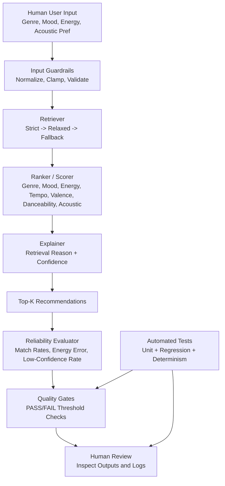
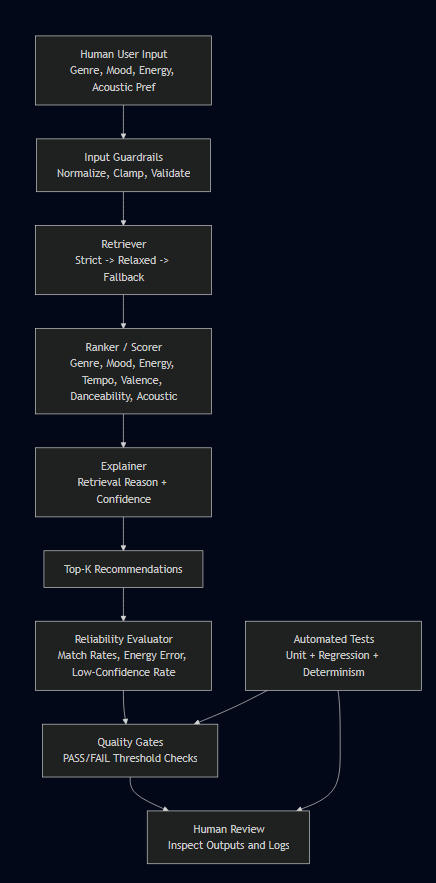

# Music Recommender Simulation

## Project Summary

This project is a content-based music recommendation system with integrated retrieval and reliability evaluation.
It matters because it demonstrates practical AI engineering beyond prompting: retrieval-first inference, transparent scoring, guardrails, and measurable reliability checks.

The system does the following:
1. Retrieves candidate songs based on user preferences before ranking.
2. Scores candidates using genre, mood, energy, tempo, valence, danceability, and acoustic preference.
3. Explains each recommendation with retrieval rationale and confidence.
4. Evaluates output quality using a built-in reliability report and quality gates.

## Original Project (Modules 1-3)

Original project name: Music Recommender Simulation.

In Modules 1-3, the project goal was to build a foundational content-based recommender that maps user preferences (genre, mood, energy) to songs and returns ranked results. The original system demonstrated basic recommendation logic and explanation strings, but relied on a simpler global scoring approach. This final version extends that foundation into a retrieval-first pipeline with guardrails and measurable reliability checks.

## Advanced AI Features Included

### 1. Retrieval-Augmented Recommendation (RAG-style retrieval)

The recommender does not score the full catalog blindly first. It retrieves candidates in stages and then ranks those candidates:
1. strict filter: genre + mood + tight energy band
2. relaxed filter: genre or mood + wider energy band
3. fallback filter: energy-only band, then full-catalog fallback if needed

This retrieval stage materially changes behavior and is integrated directly in [src/recommender.py](src/recommender.py).

Stretch enhancement implemented:
1. Added external retrieval documents in [data/retrieval_documents.json](data/retrieval_documents.json) as a second data source.
2. Retrieval now uses both song metadata and custom alias knowledge to expand queries.
3. Measured improvement is reported in runtime output under RAG Enhancement Evaluation.

### 2. Reliability and Testing System

Reliability is integrated into runtime and tests:
1. per-profile reliability metrics in [src/reliability.py](src/reliability.py)
2. quality-gate pass/fail checks in [src/quality_gates.py](src/quality_gates.py)
3. deterministic and regression tests in [tests/test_reliability_regression.py](tests/test_reliability_regression.py)

## Design and Architecture





## Architecture Overview

How data flows:
1. Input: user profile enters the system.
2. Process: guardrails validate input, retriever narrows candidates, ranker scores them, explainer adds reasons and confidence.
3. Output: top-k recommendations are shown.
4. Validation: evaluator computes reliability metrics and quality gates enforce minimum standards.
5. Human and testing checkpoints: humans review outputs/logs, and automated tests continuously verify behavior.

## Sample Interactions

The following examples are from running [src/main.py](src/main.py) with the current implementation.

### Example 1: High-Energy Pop

Input:
- genre: pop
- mood: happy
- energy: 0.90

Result snapshot:
- Sunrise City (Neon Echo), score 5.20, confidence high (0.78)
- Gym Hero (Max Pulse), score 4.40, confidence medium (0.66)
- Retrieval mode: relaxed (genre or mood plus wider energy band)

Takeaway: standard preference profiles receive strong, higher-confidence matches.

### Example 2: Chill Lofi

Input:
- genre: lofi
- mood: chill
- energy: 0.30

Result snapshot:
- Midnight Coding (LoRoom), score 5.24, confidence high (0.79)
- Library Rain (Paper Lanterns), score 5.11, confidence high (0.77)
- Retrieval mode: relaxed (genre or mood plus wider energy band)

Takeaway: when mood, genre, and energy align with catalog coverage, both quality and confidence improve.

### Example 3: Zero-Energy EDM (stress case)

Input:
- genre: edm
- mood: intense
- energy: 0.00

Result snapshot:
- Tear Drops (Melancholy Strings), score 2.83, confidence low (0.38)
- Spacewalk Thoughts (Orbit Bloom), score 2.66, confidence low (0.36)
- Retrieval mode: energy-fallback

Takeaway: contradictory requests trigger fallback retrieval and lower confidence, which is surfaced explicitly.

Reliability output from the same run:
- Overall genre match rate: 0.23
- Overall mood match rate: 0.27
- Overall average energy error: 0.173
- Overall low-confidence rate: 0.67
- Quality Gates: PASS

## Reproducible Setup

Tested environment:
1. Windows
2. Python 3.13

### 1) Create and activate virtual environment

Windows PowerShell:

```powershell
python -m venv .venv
.\.venv\Scripts\Activate.ps1
```

Mac/Linux:

```bash
python -m venv .venv
source .venv/bin/activate
```

### 2) Install pinned dependencies

```bash
pip install -r requirements.txt
```

### 3) Run the application

```bash
python -m src.main
```

The app prints:
1. recommendation tables per profile
2. structured logs for retrieval/guardrail behavior
3. reliability report
4. quality gates pass/fail status

### 4) Run tests

```bash
pytest -q
```

## Guardrails and Logging

The pipeline includes production-style safety checks:
1. input normalization and clamping (for example, energy in [0, 1])
2. safe handling of invalid/missing preferences
3. safe handling of empty catalogs and non-positive k
4. malformed CSV row skipping with warnings
5. structured logging for load, retrieval mode, backfill, and ranking

## Design Decisions and Trade-offs

1. Retrieval-before-ranking: I chose a staged retriever (strict, relaxed, fallback) so the system can narrow candidates before scoring. Trade-off: fallback can return less semantically aligned songs when the catalog is sparse.
2. Interpretable weighted scoring: I used explicit feature weights (genre, mood, energy, tempo, valence, danceability, acousticness) for transparency. Trade-off: hand-tuned weights are easier to explain but less adaptive than learned models.
3. Confidence labels in explanations: I added confidence values and labels to make uncertainty visible. Trade-off: confidence is heuristic (score- and mode-based), not statistically calibrated.
4. Runtime reliability gates: I integrated quality gates directly into the run output so failures are immediately visible. Trade-off: threshold settings can be strict or lenient depending on dataset size and goals.

## Testing Summary

Current automated test status: 12 passing tests.

At a glance:
1. Test result: 12/12 passing.
2. Runtime quality gates: PASS.
3. Primary weakness: contradictory profiles increase low-confidence recommendations.

What worked:
1. Deterministic behavior for fixed inputs and fixed dataset.
2. Retrieval behavior verification (including fallback/backfill paths).
3. Guardrail validation (invalid inputs, empty catalog, non-positive k).
4. Reliability metric and quality gate checks.

What did not work initially:
1. Retrieval sometimes produced fewer than k results, which broke expectations.
2. Module execution path initially failed on import style.

What I changed:
1. Added candidate backfill to preserve top-k behavior.
2. Added package-safe import fallback in [src/main.py](src/main.py).

What I learned:
1. Reliability checks and explicit thresholds catch regressions faster than manual inspection.
2. Clear explanations and logs make AI systems much easier to debug and trust.

## Step 4: Reliability and Evaluation

Reliability methods used:
1. Automated tests: unit, integration, quality-gate, and deterministic regression tests.
2. Confidence scoring: each recommendation includes a confidence value and label.
3. Logging and error handling: structured logs plus guardrails for invalid inputs and fallback behavior.
4. Human evaluation: manual review of recommendation quality and explanation clarity across normal and adversarial profiles.

Current summary (latest run):
1. 13 out of 13 automated tests passed.
2. Quality gates passed (overall genre 0.23, mood 0.27, average energy error 0.173, low-confidence rate 0.67).
3. The system remains strongest on standard profiles (for example, High-Energy Pop and Chill Lofi).
4. It still struggles on contradictory profiles (for example, Zero-Energy EDM), where fallback retrieval increases low-confidence outputs.
5. Reliability improved after adding input validation/clamping, staged retrieval, and top-k backfill logic.

One-line evaluation summary:
13/13 tests passed; quality gates passed; reliability is strongest when profile intent matches available catalog semantics, and weakest under contradictory constraints.

## Stretch Feature: RAG Enhancement (+2)

What was built:
1. Extended retrieval with custom external documents ([data/retrieval_documents.json](data/retrieval_documents.json)).
2. Combined two sources during retrieval: song catalog metadata + retrieval document aliases.
3. Added an enhancement evaluator in [src/rag_enhancement.py](src/rag_enhancement.py) and runtime reporting in [src/main.py](src/main.py).

Measured impact (latest run):
1. Profiles evaluated: 3 synonym-heavy profiles.
2. Baseline semantic hit rate: 0.00 (built-in aliases only).
3. Enhanced semantic hit rate: 1.00 (with custom retrieval documents).
4. Absolute improvement: +1.00.

Interpretation:
The custom document source improves retrieval for non-canonical user language (for example, electronic, rap, soul, calm, upbeat, melancholic), which increases semantic alignment in top-k recommendations.

## Reflection

This project reinforced that good AI systems are more than a scoring formula. The strongest improvement came from combining retrieval, guardrails, and evaluation into one pipeline with observable behavior. I also learned that contradictory user requests are inevitable, so confidence labels and fallback strategies are essential for honest outputs.

From a problem-solving perspective, the biggest shift was moving from "does it return songs?" to "is the system reliable, testable, and explainable?" That mindset made the project much closer to real-world AI engineering and portfolio-ready for future employers.

## Repository Structure

Core files:
1. [src/recommender.py](src/recommender.py): retrieval, scoring, explanations, guardrails
2. [src/main.py](src/main.py): CLI runner, profile execution, reliability and quality report output
3. [src/reliability.py](src/reliability.py): metric computation for profile and batch outputs
4. [src/quality_gates.py](src/quality_gates.py): threshold checks and PASS/FAIL logic

Tests:
1. [tests/test_recommender.py](tests/test_recommender.py)
2. [tests/test_reliability.py](tests/test_reliability.py)
3. [tests/test_quality_gates.py](tests/test_quality_gates.py)
4. [tests/test_reliability_regression.py](tests/test_reliability_regression.py)

## Known Limitations

1. Small static dataset (17 songs) limits coverage and diversity.
2. No collaborative filtering or user-behavior learning.
3. Alias maps for mood/genre are curated and not learned automatically.

## Additional Documentation

1. [model_card.md](model_card.md)
2. [reflection.md](reflection.md)

For ethics and responsible AI discussion, see the Reflection and Ethics section in [reflection.md](reflection.md).

