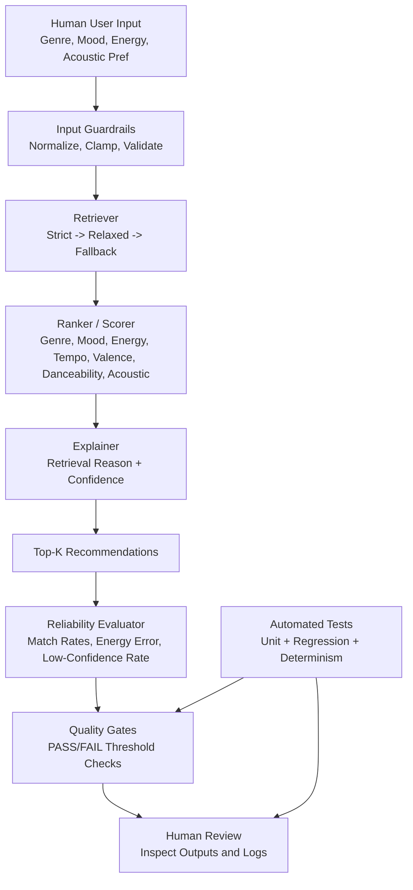

# Model Card: Music Recommender Simulation

## Model Name
MatchYourVibe

## Goal / Task
Suggest the top 3 to 5 songs for a user profile using content features and explain why each recommendation was selected.

User profile fields:
1. preferred genre
2. preferred mood
3. target energy
4. acoustic preference flag

## Data Used
Source: data/songs.csv
Additional retrieval source: data/retrieval_documents.json

Dataset properties:
1. 17 songs (small, static catalog)
2. metadata fields: title, artist, genre, mood
3. numeric audio fields: energy, tempo_bpm, valence, danceability, acousticness
4. custom retrieval alias documents for synonym expansion across genre and mood
5. no user behavior data (no clicks, skips, likes, playlists)

## System Architecture

### Retrieval-Augmented Recommendation Stage
The recommender uses retrieval before ranking:
1. strict retrieval: genre + mood + tight energy band
2. relaxed retrieval: genre or mood + wider energy band
3. fallback retrieval: energy-only band, then full-catalog fallback

This retrieval stage is integrated in the main inference path and changes which songs are eligible for ranking.

Stretch enhancement:
1. external retrieval documents are loaded from data/retrieval_documents.json
2. retrieval merges built-in aliases with external document aliases
3. reverse alias lookup supports non-canonical user language (for example, electronic -> edm/synthwave)

### Ranking Stage
Each candidate is scored with weighted signals:
1. genre exact match
2. mood exact match
3. energy proximity
4. tempo alignment (tempo vs target-energy estimate)
5. mood-valence fit
6. danceability fit
7. acoustic preference bonus/penalty

### Explanation and Confidence
Each recommendation includes:
1. retrieval reason (strict, relaxed, fallback, or backfilled)
2. feature-level scoring reasons
3. confidence value in [0, 1] and confidence label (high/medium/low)

## Design and Architecture Diagram

Data flow summary:
1. Input: user profile enters the pipeline.
2. Process: guardrails validate inputs, retriever narrows candidates, ranker scores, explainer annotates confidence.
3. Output: top-k recommendations are returned.
4. Validation: evaluator computes reliability metrics and quality gates enforce pass/fail checks.
5. Oversight: humans review outputs/logs while automated tests guard against regressions.

## Guardrails and Safety
The application includes integrated guardrails:
1. invalid or missing user preference handling
2. energy parsing and clamping to [0, 1]
3. non-positive k returns empty safely
4. empty catalog handling
5. malformed CSV row skipping
6. structured logs for load, retrieval mode, backfill, and ranking

## Evaluation and Reliability System
Runtime reliability report computes per-profile and overall metrics:
1. genre match rate
2. mood match rate
3. average energy error
4. average score
5. low-confidence rate

Quality gates enforce minimum acceptable behavior:
1. overall_genre_match_rate >= 0.20
2. overall_mood_match_rate >= 0.20
3. overall_avg_energy_error <= 0.25
4. overall_low_confidence_rate <= 0.75

The current application run reports Quality Gates: PASS.

## Stretch Feature Evaluation (RAG Enhancement)
Measured on synonym-heavy profiles using baseline vs enhanced retrieval:
1. profiles evaluated: 3
2. baseline semantic hit rate: 0.00
3. enhanced semantic hit rate: 1.00
4. absolute improvement: +1.00

Interpretation:
Adding a second retrieval source (custom documents) measurably improves semantic alignment when user input uses synonyms not present in the base song labels.

## Observed Behavior / Biases
1. Small catalog means recommendations are sometimes the least-worst matches.
2. Contradictory profiles can trigger fallback retrieval and low confidence.
3. Alias-based matching can still miss nuanced user intent.
4. No collaborative filtering means no personalization from behavior history.

## Intended Use
1. classroom project for learning recommendation pipelines
2. demonstration of retrieval + ranking + reliability evaluation

## Non-Intended Use
1. production recommendation for real users
2. safety-critical or high-stakes decisions

## Limitations
1. tiny fixed dataset
2. no user feedback loop
3. no learned embedding model
4. manually curated alias rules

## Future Improvements
1. larger and more diverse music catalog
2. hybrid collaborative + content-based ranking
3. learned semantic retrieval instead of rule-only aliases
4. calibration of confidence with user feedback data
5. fairness checks across genres and mood clusters
